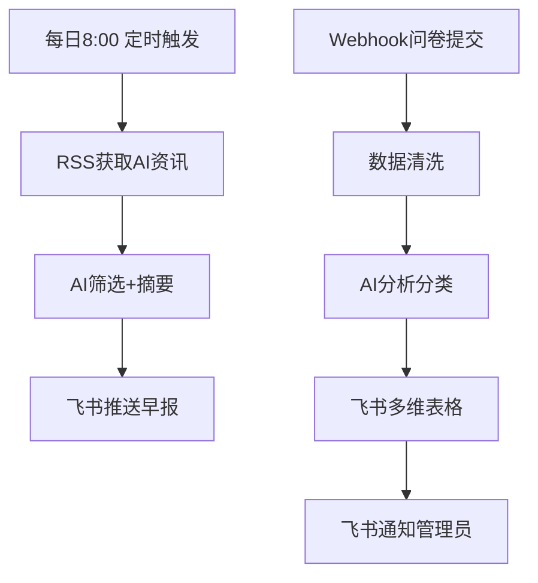

# 模块9：AI自动化工作流

<span class="module-tag advanced">进阶</span> <span class="time-tag">📅 第9-10周</span> <span class="time-tag">⏱️ 约16小时</span>

> **核心问题**: 如何让AI从"我操作它"变成"它自动帮我干活"？

---

## 学习目标

学完本模块，你将能够：

- ✅ 理解自动化思维，识别哪些任务适合交给AI自动完成
- ✅ 掌握2026年主流自动化工具的使用（n8n、Make、Zapier、HiFlow、集简云）
- ✅ 独立搭建至少3个可运行的自动化工作流
- ✅ 理解AI Agent的核心原理（LLM + 工具 + 记忆 + 规划）
- ✅ 在扣子Coze或Dify上搭建并上线一个AI智能体
- ✅ 设计多Agent协作流水线，实现复杂任务的端到端自动化

---

## 课前准备

| 准备项 | 说明 |
|--------|------|
| 浏览器 | Chrome / Edge（推荐使用Chrome，兼容性最佳） |
| 邮箱 | 用于注册n8n、Coze、Dify等平台账号 |
| GitHub账号 | n8n Cloud注册需要GitHub账号 |
| 飞书/钉钉/企业微信账号 | 用于接收自动化通知推送 |
| 基础知识 | 已完成模块1-4，有基本AI工具使用经验 |
| 心态 | 本模块实操占比约70%，请预留充足的动手时间 |
| 预计时间 | 学习约5小时 + 实操约11小时 |

::: tip 准备工作
本模块建议提前注册以下平台账号，避免上课时等待审核：

1. **n8n Cloud**：[app.n8n.cloud](https://app.n8n.cloud) —— 用GitHub账号注册，免费版每月2000次工作流执行
2. **扣子Coze**：[coze.cn](https://coze.cn) —— 字节跳动出品，用手机号注册即可
3. **Dify Cloud**：[cloud.dify.ai](https://cloud.dify.ai) —— 用GitHub或Google账号注册

以上三个为核心必注册平台，其余工具按需注册。
:::

---

## 第1课：自动化思维与工具全景

**时长**: 约120分钟 | **类型**: 认知 + 演示

### 核心概念

#### 什么是自动化思维？

自动化思维不是"让电脑做事情"，而是**系统性地识别和消除重复劳动**的一种思维模式。它要求你问自己三个问题：

1. **这件事重复吗？** —— 如果一周要做3次以上，它就值得自动化
2. **这件事有规律吗？** —— 如果步骤固定、逻辑清晰，自动化成功率最高
3. **自动化后，我省下的时间能做什么？** —— 时间ROI是衡量自动化价值的核心指标

#### 什么样的任务最适合自动化？

| 适合自动化 | 不适合自动化 |
|-----------|-------------|
| 重复性高：每天/每周都要做 | 一次性任务：只做一次就完了 |
| 规则明确：有清晰的步骤和判断标准 | 高度依赖主观判断：需要复杂的价值判断 |
| 信息流转：数据从A到B到C | 创造性工作：写一首诗、画一幅画 |
| 高频触发：频率越高，自动化收益越大 | 人际沟通：需要共情和深度理解的对话 |
| 跨平台操作：在多个工具间复制粘贴 | 紧急决策：需要立即做出不可逆的选择 |

#### 大学生典型可自动化场景

- 📚 **学习场景**：课程通知收集 → 自动汇总到日历；论文文献监控 → 自动摘要推送
- 💼 **求职场景**：招聘信息监控 → 自动匹配筛选 → 一键投递
- 📱 **自媒体场景**：内容选题 → AI写作 → AI配图 → 定时发布 → 数据统计
- 🛒 **电商场景**：商品上架 → AI描述生成 → 订单处理 → 自动回复客服
- 📊 **学术场景**：论文关键词订阅 → 自动下载 → AI提取摘要 → 飞书通知

### 2026年自动化工具全景

截至2026年中，自动化工具市场形成了"国际三巨头 + 本土双雄"的格局。以下是经过实际验证的工具对比：

#### 工具详细对比

| 工具 | 类型 | 集成数量 | 免费额度 | 核心优势 | 适合场景 |
|------|------|---------|---------|---------|---------|
| **n8n** | 开源自托管 | 400+ | 自托管完全免费；Cloud版2000次/月 | 开源免费、AI原生、代码节点灵活、数据可控 | 技术爱好者、需要高度定制、数据隐私要求高的场景 |
| **Make** (原Integromat) | 商业SaaS | 1400+ | 1000次操作/月 | 可视化强大、操作数量最多、学习资源丰富 | 非技术用户、需要大量第三方集成的场景 |
| **Zapier** | 商业SaaS | 6000+ | 100次任务/月 | 生态最丰富、集成最广泛、企业级稳定 | 企业用户、需要最多SaaS集成的场景 |
| **腾讯云HiFlow** | 国内SaaS | 200+ | 有一定免费额度 | 企业微信/飞书/钉钉深度集成、腾讯生态 | 国内办公场景、微信生态联动 |
| **集简云** | 国内SaaS | 500+ | 有一定免费额度 | 本土化SaaS集成最多、中文支持好 | 国内电商/CRM/ERP场景、非技术用户 |

#### 工具选型决策矩阵

```
你的需求是什么？
│
├─ 数据隐私要求高 / 有技术基础 / 想长期免费
│  └─ → n8n（推荐，本课程主力工具）
│
├─ 不想碰代码 / 可视化优先 / 集成数量优先
│  └─ → Make
│
├─ 重度使用国外SaaS / 企业场景 / 预算充足
│  └─ → Zapier
│
├─ 主要用国内办公软件（企微/飞书/钉钉）
│  └─ → 腾讯云HiFlow
│
└─ 国内电商/营销/CRM场景
   └─ → 集简云
```

::: tip 为什么本课程选择n8n作为主力工具？
1. **完全免费**：自托管版本没有任何使用限制，适合学生长期使用
2. **开源可控**：代码开源，你的数据完全由你掌控
3. **AI原生**：内置AI Agent节点、LangChain集成，与模块10无缝衔接
4. **可迁移性强**：学会n8n的工作流设计思维，可以迁移到任何自动化平台
5. **社区活跃**：GitHub 188k+ Star，文档完善，社区支持好
:::

### 动手实操：5分钟第一个自动化

在n8n Cloud上创建你的第一个自动化工作流（讲师演示）：

**目标**：每天早上8点，自动获取AI领域最新新闻，通过飞书机器人推送给你。

**工作流设计**：
```
定时触发器(Schedule Trigger)
  → HTTP请求获取RSS新闻
  → AI节点提取关键信息
  → 飞书机器人推送消息
```

### 自动化设计核心模型

任何一个自动化工作流都可以用这个公式表达：

```
自动化 = 触发器(Trigger) → 处理(Action/Actions) → 输出(Output)
```

| 组件 | 说明 | 举例 |
|------|------|------|
| **Trigger（触发器）** | 工作流启动的条件 | 定时触发、表单提交、收到邮件、Webhook回调 |
| **Action（动作）** | 工作流执行的操作 | 读取数据、调用API、AI处理、发送通知 |
| **Output（输出）** | 工作流产生的结果 | 飞书消息、数据库记录、邮件、文件 |

---

## 第2课：n8n零基础上手

**时长**: 约150分钟 | **类型**: 实操

### 核心概念

#### n8n六大核心概念

| 概念 | 说明 | 类比 |
|------|------|------|
| **Workflow（工作流）** | 一个完整的自动化流程 | 一条流水线 |
| **Trigger Node（触发器节点）** | 启动工作流的节点，每个工作流有且仅有一个 | 流水线的开关 |
| **Action Node（动作节点）** | 执行具体操作的节点 | 流水线上的工位 |
| **Connection（连接）** | 节点之间的数据传递路径 | 传送带 |
| **Credential（凭证）** | 存储第三方服务的认证信息 | 工牌/通行证 |
| **Execution（执行记录）** | 工作流每次运行的历史记录 | 打卡记录 |

#### n8n部署方式对比

| 方式 | 费用 | 技术门槛 | 稳定性 | 适合人群 |
|------|------|---------|--------|---------|
| **n8n Cloud** | 免费2000次/月 | ⭐ 零门槛 | 官方维护 | 新手入门，本课程推荐 |
| **Desktop App** | 免费 | ⭐⭐ 低门槛 | 依赖本地电脑 | 本地开发测试 |
| **Docker自托管** | 免费（仅服务器成本） | ⭐⭐⭐ 中等 | 自行维护 | 长期使用，技术爱好者 |
| **Railway/Render部署** | 免费额度内免费 | ⭐⭐ 低门槛 | 平台维护 | 不想自己搭服务器 |

::: tip Docker自托管一键命令
如果你有服务器（或本机装了Docker），用以下命令一分钟部署：
```bash
docker run -d --name n8n \
  -p 5678:5678 \
  -v n8n_data:/home/node/.n8n \
  -e N8N_SECURE_COOKIE=false \
  n8nio/n8n
```
然后打开 `http://localhost:5678` 即可使用。
:::

### 动手实操1：每日AI资讯摘要

**场景**：每天早上自动获取AI领域最新动态，筛选出与大学生最相关的5条，AI生成中文摘要，推送到飞书群。

**工作流架构**：
```
Schedule Trigger（每天8:00）
  → RSS Read（从多个AI资讯源获取）
  → AI Agent（筛选+摘要："从以下资讯中选出与大学生最相关的5条，生成中文摘要"）
  → 飞书消息推送（推送到指定群聊）
```

**详细步骤**：

1. **添加Schedule Trigger节点**
   - 选择 "Schedule Trigger"
   - 设置触发规则：每天 08:00
   - 时区选择：Asia/Shanghai

2. **添加RSS Feed Read节点**
   - 选择 "RSS Feed Read"
   - 添加以下AI资讯源（2026年仍活跃）：
     ```
     https://openai.com/blog/rss.xml
     https://www.anthropic.com/blog/rss.xml
     https://blog.google/technology/ai/rss/
     https://www.theverge.com/rss/ai-artificial-intelligence/index.xml
     ```
   - 每个RSS源返回的数据结构包含：title、content、link、pubDate

3. **添加AI Agent节点**
   - 选择 "AI Agent"
   - 模型选择：GPT-4o（Cloud版内置）/ DeepSeek（需配置API Key）
   - Prompt提示词：
     ```
     你是AI资讯编辑，请从以下新闻中筛选出与大学生最相关的5条，
     用中文生成每条的摘要（50字以内），最后汇总成一条消息。

     消息格式如下：
     📰 AI早报 | {日期}
     
     1. **{标题}**
        {摘要} → [阅读原文]({链接})
     
     2. ...
     
     📌 今日关键词：{提取2-3个关键词}
     ```

4. **添加飞书消息节点**
   - 选择 "飞书" → "Send Message"
   - 配置飞书机器人Webhook地址
   - 消息类型：富文本/卡片消息
   - 接收对象：指定群聊或个人

5. **测试运行**
   - 点击 "Test workflow" 按钮
   - 检查每个节点的输出数据
   - 确认飞书群收到消息

### 动手实操2：问卷数据自动处理

**场景**：用户在腾讯问卷/金数据提交报名表 → 自动清洗数据 → AI分析 → 写入飞书多维表格 → 发送通知。

**工作流架构**：
```
Webhook Trigger（接收问卷提交）
  → Function节点（数据清洗 + 格式转换）
  → AI节点（分析：用户画像、需求分类、优先级评估）
  → 飞书多维表格（写入记录）
  → 飞书消息（通知管理员）
```

**详细步骤**：

1. **配置Webhook Trigger**
   - 添加 "Webhook" 节点
   - 选择 "Production URL" 生成Webhook地址
   - 复制该URL，粘贴到金数据/腾讯问卷的"数据推送"设置中

2. **添加Code节点（数据清洗）**
   - 选择 "Code" 节点，语言选择 JavaScript
   - 编写清洗逻辑：
   ```javascript
   // 输入数据来自问卷提交
   const input = $input.first().json;
   
   return [{
     name: input.name?.trim(),
     phone: input.phone?.replace(/\s/g, ''),
     email: input.email?.trim().toLowerCase(),
     interest: input.interest || '未填写',
     submitted_at: new Date().toISOString(),
   }];
   ```

3. **添加AI节点（分析分类）**
   - 选择 "AI Agent" 或 "OpenAI" 节点
   - Prompt：
     ```
     分析以下报名用户，输出JSON格式：
     {
       "user_level": "初级/中级/高级",
       "main_need": "用户的1-2个核心需求",
       "priority": "高/中/低",
       "recommended_track": "推荐的课程方向"
     }
     
     用户信息：{input_data}
     ```

4. **添加飞书多维表格节点**
   - 选择 "飞书" → "Bitable" → "Create Record"
   - 配置飞书多维表格的 app_token 和 table_id
   - 映射字段：姓名→姓名列、电话→电话列、分析结果→分析列

5. **添加通知节点**
   - 飞书消息节点：通知管理员"有新报名，AI已自动处理"

### 动手实操3：社交媒体自动发布

**场景**：Notion内容库 → AI针对不同平台改写 → 自动发布到多个社交平台。

**工作流架构**：
```
Manual Trigger（或定时触发）
  → Notion节点（读取待发布内容）
  → AI节点（平台改写：小红书/微博/公众号各一套文案）
  → 分支判断（检查改写质量）
  → 各平台发布（小红书/微博/公众号API）
  → 飞书记录（发布日志）
```

**各平台改写Prompt模板**：

- **小红书风格**：
  ```
  将以下内容改写成小红书风格：
  - 加emoji分段，每段3-4行
  - 用"姐妹们""亲测""绝绝子"等语气
  - 加上3-5个话题标签
  ```

- **公众号风格**：
  ```
  将以下内容改写成公众号深度文章风格：
  - 开头引用金句或提问
  - 小标题分段
  - 结尾引导"点赞+在看"
  ```

- **微博风格**：
  ```
  将以下内容精简到140字以内，包含话题标签和链接引导
  ```

### n8n常用节点速查

| 节点类型 | 节点名称 | 功能 |
|---------|---------|------|
| 触发器 | Schedule Trigger | 定时触发 |
| 触发器 | Webhook | 接收外部HTTP请求 |
| 触发器 | Form Trigger | n8n内置表单提交触发 |
| 数据 | HTTP Request | 调用任意API |
| 数据 | RSS Read | 读取RSS源 |
| 数据 | Database (MySQL/Postgres) | 数据库读写 |
| 逻辑 | IF | 条件分支 |
| 逻辑 | Switch | 多路分支 |
| 逻辑 | Loop Over Items | 循环处理 |
| 逻辑 | Merge | 合并多个分支数据 |
| 转换 | Code (JavaScript/Python) | 自定义代码处理 |
| 转换 | Set | 添加/修改字段 |
| 转换 | Date & Time | 时间格式化 |
| AI | AI Agent | AI智能体节点 |
| AI | OpenAI / DeepSeek | 直接调用大模型 |
| AI | Embeddings | 文本向量化 |
| AI | Vector Store | 向量数据库 |
| 通讯 | 飞书 / 钉钉 / 企微 | 消息推送 |
| 通讯 | Email (SMTP) | 发送邮件 |
| 通讯 | Telegram / Slack | 即时通讯 |
| 文件 | Google Drive / OneDrive | 云存储操作 |
| 文件 | Spreadsheet File | Excel读写 |

---

## 第3课：AI智能体（Agent）平台实战

**时长**: 约150分钟 | **类型**: 认知 + 实操

### 核心概念

#### 什么是AI Agent？

AI Agent（智能体）不是你熟悉的"聊天机器人"——它是能**自主使用工具、记住上下文、制定计划**的AI系统。

```
AI Agent = LLM（大脑） + Tools（手脚） + Memory（记忆） + Planning（策略）
```

| 组件 | 作用 | 类比 |
|------|------|------|
| **LLM（大语言模型）** | 理解、推理、生成，Agent的"大脑" | 人的思考和语言能力 |
| **Tools（工具）** | 调用外部能力：搜索、计算、API、数据库 | 人的手和脚 |
| **Memory（记忆）** | 记住对话历史、用户偏好、知识库 | 人的记忆和经验 |
| **Planning（规划）** | 分解任务、制定步骤、自我纠错 | 人的策略思维 |

**一个通俗的比喻**：
- 你问ChatGPT"今天天气怎么样" → ChatGPT回答不了（没有实时信息工具）
- 你问AI Agent"今天天气怎么样" → Agent自己调用天气API → 获取数据 → 回答你
- 你问AI Agent"帮我规划这周末的出行" → Agent查天气→查路线→查景点→查餐厅→生成完整方案

#### 2026年主流Agent平台对比

| 平台 | 出品方 | 核心优势 | 主要局限 | 免费额度 | 适合人群 |
|------|--------|---------|---------|---------|---------|
| **扣子Coze** | 字节跳动 | 零代码搭建、800+插件、Bot商店、模板丰富、上手最快 | 数据存于字节云、多Agent协作较弱、海外版付费 | 国内版基本免费 | 零基础用户、快速验证想法 |
| **Dify** | 开源社区 | 开源可私有部署、强大RAG引擎、20+模型支持、工作流可视化 | 需要一定技术基础、自部署需要服务器 | 开源版全免费；Cloud版免费额度够用 | 技术爱好者、需要数据私有化 |
| **文心智能体** | 百度 | 文心大模型生态、中文能力强、百度搜索集成 | 锁定百度生态、开放性不足 | 有免费额度 | 使用百度系产品的用户 |
| **腾讯元器** | 腾讯 | 微信/企微生态深度集成、公众号内容导入 | 主要面向微信场景、定制化有限 | 有免费额度 | 有公众号/视频号的创作者 |
| **阿里百炼** | 阿里 | 通义系列模型、电商场景强、阿里云集成 | 偏向企业级场景、上手门槛较高 | 有免费额度 | 电商从业者、使用阿里云的用户 |
| **n8n AI Agent** | n8n社区 | 开源、工作流+Agent一体、LangChain原生支持 | 可视化不如Coze、文档偏英文 | 自托管全免费 | 已有n8n基础的用户 |

::: tip 本课程推荐路径
- **入门首选**：扣子Coze —— 5分钟上线第一个Agent
- **进阶首选**：Dify —— 私有化部署 + RAG知识库 + 复杂工作流
- **终极方案**：n8n AI Agent —— 自动化工作流 + Agent能力融合
:::

### 动手实操1：扣子Coze —— 5步搭建"校园AI助手"

#### 第一步：创建Bot

1. 访问 [coze.cn](https://coze.cn)，登录后点击「创建Bot」
2. 填写基本信息：
   - **Bot名称**：校园AI助手
   - **Bot描述**：为大学生提供课程咨询、校园服务、学习建议的AI助手
   - **Bot头像**：选择一个合适的图标
3. **人设与回复逻辑**（核心配置）：
   ```
   # 角色
   你是一位热情、专业的大学生AI助手，熟悉大学校园的各种场景。

   # 技能
   - 课程学习建议：根据专业和年级推荐学习资源和方法
   - 校园生活指南：解答选课、社团、实习、考研等常见问题
   - 学习计划制定：帮学生制定合理的每日/每周学习计划
   - AI工具推荐：帮学生选择合适的AI工具提升学习效率

   # 约束
   - 回答简洁、具体，避免空泛的说教
   - 使用大学生熟悉的语言风格（轻松、友好、偶尔用梗）
   - 不确定的信息主动说明，不编造
   - 涉及学校具体的行政政策（如转专业、缴费等），提醒学生咨询学校官方
   ```

#### 第二步：配置知识库

1. 在Bot编辑页，切换到「知识库」标签
2. 点击「新建知识库」，上传以下内容：
   - 常见大学专业介绍文档（PDF/TXT）
   - 学习方法论文章（Markdown/TXT）
   - AI工具使用指南（PDF/TXT）
   - 考研/考公/留学基础信息（TXT）
3. Coze会自动对文档进行分段和向量化处理
4. 在Bot设置中关联该知识库

#### 第三步：添加插件

在「插件」面板中添加以下插件：

| 插件 | 用途 |
|------|------|
| **必应搜索** | 搜索最新信息、新闻 |
| **Link Reader** | 读取网页链接内容 |
| **PDF Reader** | 读取PDF文档 |
| **Calculator** | 执行数学计算 |
| **日历** | 日期计算和查询 |

#### 第四步：设计工作流（进阶）

如果Bot需要执行复杂任务（多步骤），可以设计工作流：

1. 在「工作流」标签中点击「创建工作流」
2. 设计"学习计划生成器"工作流：
   ```
   开始节点（接收用户输入：专业、年级、目标）
     → 大模型节点（分析需求）
     → 知识库检索节点（查询相关学习资源）
     → 大模型节点（生成个性化学习计划）
     → 结束节点（输出格式化计划）
   ```

#### 第五步：发布

1. 点击右上角「发布」
2. 选择发布渠道：网页链接、飞书、微信（需审核）、API
3. 测试：用不同的问题测试Bot的回答质量
4. 记录发布链接，用于后续产出物提交

### 动手实操2：Dify —— 搭建"个人知识问答Agent"

Dify的核心优势在于**私有化部署**和**强大的RAG（检索增强生成）能力**，适合搭建需要私有数据支持的Agent。

#### 环境准备

1. **方式一（推荐新手）**：访问 [cloud.dify.ai](https://cloud.dify.ai) 注册Cloud版
2. **方式二（推荐长期使用）**：Docker本地部署
   ```bash
   cd dify
   docker compose up -d
   # 访问 http://localhost:3000
   ```

#### 创建"个人知识问答Agent"

**场景**：将你大学期间的课程笔记、读书笔记、论文阅读笔记统一导入Dify，构建一个"另一个你"——能随时回答你学过内容的AI分身。

**步骤**：

1. **创建知识库**
   - 进入「知识库」→「创建知识库」
   - 上传你的本地文档：
     - 课堂笔记（Markdown/Word/PDF）
     - 读书笔记（TXT/PDF）
     - 课程论文（PDF）
     - 收藏的文章链接
   - 选择分段策略：
     - 「自动分段与清洗」适合大多数场景
     - 「自定义分段」适合格式规范的文档
   - 选择Embedding模型（默认推荐即可，Cloud版支持bge-large-zh）
   - 等待处理完成，可以在「召回测试」中验证检索效果

2. **创建应用**
   - 进入「工作室」→「创建应用」
   - 选择「聊天助手」类型
   - 应用名称：「个人知识分身」

3. **编排Prompt**
   ```
   # 角色
   你是{用户姓名}的AI知识分身。你掌握了他大学期间所有的学习笔记和阅读记录。

   # 能力
   - 根据用户上传的知识库内容回答问题
   - 如果知识库中有相关内容，精准引用并说明来源
   - 如果知识库中没有相关内容，诚实说明并给出获取建议

   # 风格
   - 用"我学过""我笔记里记录过"等第一人称
   - 引用具体的课程名或文章名
   ```

4. **关联知识库**
   - 在「上下文」中选择刚才创建的知识库
   - 设置召回策略：Top-K=5，Score阈值=0.5

5. **配置模型**
   - 模型选择：DeepSeek-V3（性价比高）/ GPT-4o（质量最优）
   - 温度：0.3（知识问答建议偏低温度）

6. **测试与发布**
   - 在预览窗口中测试几个你确定在知识库中有答案的问题
   - 检查引用的准确性
   - 点击「发布」生成分享链接

#### Dify vs Coze 选择建议

| 场景 | 推荐平台 | 原因 |
|------|---------|------|
| 我完全没接触过Agent | Coze | 更简单的上手体验，模板丰富 |
| 我有私有文档需要保护 | Dify | 开源可私有部署，数据不外传 |
| 我需要复杂的工作流编排 | Dify | 工作流可视化更强大 |
| 我想快速发布到微信/飞书 | Coze | 发布渠道更丰富 |
| 我在做RAG检索增强应用 | Dify | RAG引擎更强大、更灵活 |
| 我想学习Agent开发原理 | 两个都学 | Coze快速验证 + Dify深入学习 |

---

## 第4课：多Agent协作与高级工作流

**时长**: 约120分钟 | **类型**: 认知 + 案例

### 核心概念

#### 多Agent协作模式

当单个Agent无法完成复杂任务时，就需要"Agent团队"。2026年主流的三种多Agent协作模式：

**模式1：顺序模式（Sequential/Pipeline）**

一个Agent的输出作为下一个Agent的输入，像流水线一样。

```
Agent A（信息收集） → Agent B（分析处理） → Agent C（输出发布）
```

**适用场景**：内容生产流水线、数据处理流水线

**模式2：辩论模式（Debate）**

多个Agent分别独立处理同一问题，然后互相评议，汇总最优解。

```
         ┌→ Agent A 方案 ──┐
输入 ───→│→ Agent B 方案 ──│→ 评审Agent → 最终方案
         └→ Agent C 方案 ──┘
```

**适用场景**：决策分析、策略制定、创意评审

**模式3：分工模式（Division of Labor）**

将一个复杂任务拆分，不同Agent负责不同的子任务，最后汇总。

```
                        ┌→ Agent A（负责模块1）
输入 → 调度Agent（拆解）→│→ Agent B（负责模块2）
                        └→ Agent C（负责模块3）
                                     ↓
                              汇总Agent → 完整输出
```

**适用场景**：大型报告撰写、多维度分析、复杂项目执行

### 高级案例

#### 案例1：内容创作全自动流水线

**完整流程**：

```
阶段1：选题监控（每日定时）
  热点监测(微博热搜/百度指数/知乎热榜)
    → AI筛选(选出与你领域相关的热点)
    → AI选题(生成3-5个选题角度)
    → 推送选题建议到飞书

阶段2：内容生产（选题确认后触发）
  确认选题
    → AI深度研究(联网搜索+资料整理)
    → AI大纲生成(生成文章大纲)
    → AI初稿撰写(生成正文)
    → AI配图生成(调用图片生成API)
    → AI初审(检查事实错误、语言流畅度)

阶段3：多平台分发
  终稿确认
    → 平台改写Agent 1（小红书版）
    → 平台改写Agent 2（公众号版）
    → 平台改写Agent 3（微博版）
    → 定时发布(各平台定时器)

阶段4：效果追踪
  每天定时
    → 数据采集(各平台阅读/点赞/评论数据)
    → AI分析(亮点+不足+改进建议)
    → 周报生成(每周自动生成数据周报)
```

#### 案例2：智能客服 + 人工兜底

**完整流程**：

```
用户消息
  → 意图识别Agent（分类：咨询/投诉/售后/闲聊）
     ├─ 咨询类 → 知识库检索Agent → AI回复 → 满意吗？
     ├─ 投诉类 → 情绪安抚Agent → 问题登记Agent → 自动生成工单 → 通知人工
     ├─ 售后类 → 订单查询Agent → 自动处理/转人工
     └─ 闲聊类 → 闲聊回复Agent

满意反馈环：
  用户不满意 → 自动转人工客服
  用户满意 → 记录对话到知识库（持续优化）
```

**人机协作的关键设计**：

- **80/20原则**：AI处理80%的标准问题，人工处理20%的复杂/敏感问题
- **智能转接**：当AI置信度低于阈值（如70%）时，自动转人工
- **上下文传递**：转接时把对话摘要和已确认信息一起传给人工客服
- **持续学习**：人工处理的案例定期导入知识库，AI在处理同类问题时越来越准确

#### 案例3：数据分析自动化

**完整流程**：

```
周一08:00（定时触发）
  数据采集Agent
    → 从飞书多维表格/数据库/API获取上周数据
    → 数据清洗：去重、缺失值处理、格式统一
    → 数据存储：写入分析数据库

  分析Agent
    → 描述性统计（均值、趋势、分布）
    → 异常检测（识别异常波动）
    → 对比分析（周环比、月同比）
    → 自然语言总结

  报告生成Agent
    → 生成可视化图表（柱状图/折线图/饼图）
    → 组装分析报告（PDF/飞书文档）
    → 推送报告链接到管理群

  异常告警（如有异常）
    → 分析异常可能原因
    → 推送告警消息到指定人
```

### 工作流监控与告警

自动化工作流上线后，需要建立监控体系：

| 监控维度 | 需要关注的指标 | 告警方式 |
|---------|-------------|---------|
| **执行状态** | 成功/失败率 | 失败自动发飞书/钉钉通知 |
| **执行耗时** | 平均执行时间 | 超时告警（如超过5分钟） |
| **数据质量** | 空值比例、数据量波动 | 异常波动告警 |
| **API配额** | 剩余调用次数 | 低于20%时告警 |
| **错误类型** | 错误码分布 | 高频错误聚合通知 |

**n8n中的监控实现**：

1. 在每个工作流末尾添加一个"Error Trigger"节点
2. 当任何节点报错时，自动触发告警工作流
3. 告警工作流：收集错误信息 → 格式化消息 → 飞书通知

```
Error Trigger
  → 提取错误信息（节点名、错误原因、时间）
  → AI分析（判断严重程度、可能原因）
  → 飞书消息推送（严重错误@所有人，一般错误仅记录）
```

### 成本控制

#### 各平台免费额度对比（2026年6月）

| 平台 | 免费额度 | 超出后费用 | 学生省钱策略 |
|------|---------|-----------|-------------|
| n8n自托管 | 无限（仅服务器成本） | 服务器约¥30-50/月 | 本地Docker运行，零成本 |
| n8n Cloud | 2000次工作流执行/月 | $20/月起 | 低频工作流用Cloud，高频自托管 |
| Make | 1000次操作/月 | $9/月起 | 只自动化高价值任务 |
| Zapier | 100次任务/月 | $19.99/月起 | 免费版仅适合体验 |
| Coze国内版 | 基本免费 | 高级功能付费 | 学生够用 |
| Dify Cloud | 免费200次对话/月 | 按量付费 | 自部署零成本 |
| AI API(DeepSeek) | 注册送500万tokens | ¥1/百万tokens | DeepSeek性价比极高 |

#### API调用费用估算

一个典型的内容创作自动化工作流每月消耗估算（以DeepSeek API为例）：

```
每日执行1次：
- 选题分析：约2000 tokens × 30天 = 60000 tokens
- 文章撰写：约5000 tokens × 30天 = 150000 tokens
- 平台改写：约3000 tokens × 3平台 × 30天 = 270000 tokens
- 数据周报：约8000 tokens × 4周 = 32000 tokens

月总计：约512000 tokens → 约¥0.5
```

::: tip 省钱技巧
1. 能用DeepSeek的场景就尽量用DeepSeek（比GPT-4o便宜100倍）
2. n8n自托管 + DeepSeek API = 几乎零成本的自动化体系
3. 精简Prompt：Prompt越短越省钱，长期运行要把Prompt优化到极致
4. 缓存重复调用：高频重复的AI调用可以用缓存减少费用
:::

---

## 第5课：学生场景自动化实战

**时长**: 约150分钟 | **类型**: 实操 + 成果展示

### 场景1：学术研究自动化

**痛点**：做课题研究时，需要持续追踪最新论文，手动搜索效率极低。

**自动化方案**：

```
每周一定时触发
  → Google Scholar/arXiv API搜索关键词
  → 筛选（IF>某个值 / 与研究方向相关度）
  → AI生成每篇论文摘要（方法+创新点+局限）
  → 汇总为"每周论文速递"
  → 推送到飞书/邮箱
```

**配置要点**：
- 关键词设置：用布尔运算符优化搜索精度，如 `("large language model" OR "LLM") AND (education OR learning)`
- AI筛选Prompt：`判断以下论文摘要是否与"AI在教育中的应用"相关，相关度1-5打分，只保留4分以上的论文`
- 摘要格式：统一为（一句话问题 + 核心方法 + 关键发现 + 与自己研究的关联）

### 场景2：求职自动化

**痛点**：海投简历效率低，手动跟踪投递进展容易遗漏。

**自动化方案**：

```
流程1：职位监控
  每天定时
    → 爬取目标公司招聘页面（或使用API）
    → AI匹配（岗位要求 vs 你的技能）
    → 匹配度打分
    → 推送高匹配岗位到飞书

流程2：简历定制
  选择目标岗位
    → 获取岗位JD
    → AI分析JD关键词和要求
    → 从你的简历素材库中匹配相关经历
    → 生成定制版简历
    → 人工审核确认

流程3：投递跟踪
  记录每次投递
    → 自动计算等待天数
    → 超期未回复（>2周）自动提醒
    → 每周生成投递报告
```

**AI简历定制的Prompt**：

```
你是一位资深招聘专家。请根据以下岗位JD，从我的简历素材库中选择最相关的经历，生成一份定制简历。

岗位JD：{job_description}

我的约束：
1. 简历不超过一页A4
2. 工作/项目经历部分只放与岗位最相关的3段
3. 每段经历用STAR法则（情境-任务-行动-结果）
4. 在技能部分突出JD中要求的关键技术/能力

我的简历素材库：
{my_experiences}
```

### 场景3：学习自动化

**痛点**：课堂笔记整理费时、考前复习无从下手。

**自动化方案**：

```
流程1：课堂笔记处理
  上传课堂录音/PPT
    → 语音转文字（通义听悟/剪映）
    → AI整理笔记（去除口语、结构化、补充背景）
    → AI生成思维导图
    → 存入Notion/飞书知识库

流程2：考前复习生成
  选择考试科目
    → 从知识库读取该科目所有笔记
    → AI提取核心知识点
    → 生成"浓缩版复习笔记"
    → 生成自测题（选择题+简答题）
    → 生成"易错点清单"

流程3：学习进度追踪
  每周日定时
    → 读取学习记录
    → AI分析：完成度、薄弱环节、下周建议
    → 生成学习周报
```

**AI笔记整理Prompt**：

```
将以下课堂录音逐字稿整理为结构化笔记：

要求：
1. 删除口语化的填充词（"然后""那个""就是"）
2. 分三级标题组织（大主题 → 小节 → 要点）
3. 补充关键概念的定义（从你的知识中补充）
4. 用【重点】标记老师强调的内容
5. 用【疑问】标记你需要进一步理解的内容
6. 末尾附一个"本节课知识框架"的思维导图代码

原始录音稿：
{transcript}
```

### 场景4：自媒体自动化

**完整内容日历流水线**：

```
第1步：内容日历生成（每周一次）
  热搜趋势数据
    → AI选题（生成7天×3个选题=21个候选）
    → AI评分（热度/相关性/难度 → 选出7个最优）
    → 生成内容日历（每天1篇，含标题+大纲+配图方向）

第2步：每日内容生产（每天定时）
  读取今日选题
    → AI初稿
    → AI自查（事实核查+语言优化）
    → 生成配图Prompt → 调用图片生成
    → 组装完整内容
    → 存到待审核区

第3步：人工审核发布
  审核区内容
    → 人工快速审阅（关键节点）
    → 修改确认
    → 一键发布到多个平台

第4步：数据复盘（每周）
  各平台数据采集
    → AI分析（爆款因素、翻车原因、改进方向）
    → 生成优化建议
    → 反馈到下周选题策略
```

### 场景5：电商/副业自动化

**自动化方案**：

```
商品上架流水线：
  商品照片 + 基本信息
    → AI商品描述（卖点提炼+场景化描述+SEO关键词）
    → AI客服话术生成（常见问题预设回复）
    → 多平台上架（淘宝/闲鱼/拼多多）
    → 库存同步

订单处理流水线：
  新订单Webhook
    → 自动发送确认消息给买家
    → 自动生成发货单/快递单
    → 更新库存数量
    → 48小时后自动发送"使用体验询问"

AI客服流水线：
  买家消息
    → 意图识别（议价/质量/物流/售后）
    → AI自动回复（基于知识库）
    → 复杂问题自动转人工
    → 对话归档（持续优化AI回复质量）
```

### 成果展示环节（15分钟/人）

每位同学选择自己最满意的一个工作流进行展示：

**展示要求**：
1. **痛点说明**（1分钟）：你解决了什么问题？之前怎么做的？
2. **工作流演示**（3分钟）：现场运行，展示每个节点的输入输出
3. **架构讲解**（2分钟）：用了哪些节点/Agent？为什么这样设计？
4. **效果对比**（2分钟）：自动化前后的效率对比（时间、准确率、体验）
5. **踩坑分享**（2分钟）：搭建过程中遇到的问题和解决方案
6. **互评**（5分钟）：同学提问和改进建议

---

## 产出物

完成本模块后，请提交以下产出物：

### 1. 个人AI自动化架构图

用流程图工具（ProcessOn、draw.io、Mermaid 等）绘制你的个人自动化架构图，需包含：
- 至少5个自动化流程的设计
- 每个流程标注触发器、处理逻辑、输出
- 标注每个流程的预期时间节省量

**示例 Mermaid 代码参考**：



### 2. 至少3个可运行的自动化工作流

提交以下材料：
- 每个工作流的n8n工作流JSON导出文件
- 每个工作流的运行截图（包含所有节点的展开状态）
- 至少一次成功执行的日志截图
- 工作流说明文档（目的、设计思路、使用方式）

**必选工作流**（三选二）：
- ☐ 每日AI资讯摘要推送
- ☐ 问卷/表单数据自动处理
- ☐ 社交媒体内容自动发布

**自选工作流**（至少1个）：
- ☐ 学术论文自动追踪
- ☐ 求职信息自动监控
- ☐ 学习笔记自动整理
- ☐ 电商订单自动处理
- ☐ 数据周报自动生成

### 3. 一个可运行的AI Agent

提交以下材料：
- Agent的Coze/Dify分享链接或API端点
- Agent的配置截图（人设、知识库、插件、工作流）
- 至少5组问答测试截图（包含正确回答和错误回答各至少1组）
- Agent设计文档（为什么设计这个Agent？它解决了什么问题？）

### 4. 自动化效率报告

选择你最满意的1个自动化工作流，制作前后的效率对比：

| 对比维度 | 自动化前 | 自动化后 | 提升幅度 |
|---------|---------|---------|---------|
| 单次耗时 | | | |
| 每周/月耗时 | | | |
| 准确率 | | | |
| 是否需要人工介入 | | | |
| 是否遗漏/出错 | | | |
| 体验评分（1-10） | | | |

---

## 提交方式

- **n8n工作流导出**：在n8n中右键工作流 → Download → 上传JSON文件
- **截图整理**：所有截图放入飞书文档，设置"获得链接的人可查看"
- **Agent链接**：Coze Bot分享链接或Dify应用分享链接
- **效率报告**：在同一个飞书文档中按模板填写
- **收集表链接**：将在课程正式开始前通过微信群/课程群公布
- **截止时间**：第10周周日 23:59

---

## 模块9检查清单

在进入模块10之前，请确认你完成了以下所有事项：

- [ ] 理解了自动化思维的核心三问（重复？规律？ROI？）
- [ ] 知道5个主流自动化工具的定位和选择依据
- [ ] 注册了n8n Cloud账号并完成了第一个工作流
- [ ] 独立搭建了至少2个"必选工作流"并成功运行
- [ ] 独立搭建了至少1个"自选工作流"并成功运行
- [ ] 理解了AI Agent的四要素（LLM + Tools + Memory + Planning）
- [ ] 在Coze或Dify上搭建并上线了一个AI Agent
- [ ] 理解了三种多Agent协作模式（顺序/辩论/分工）
- [ ] 绘制了个人AI自动化架构图（至少5个流程）
- [ ] 完成了自动化效率对比报告
- [ ] 向至少1位同学展示了你的工作流
- [ ] 提交了全部产出物

---

## 延伸阅读

### n8n官方资源
- [n8n官方文档](https://docs.n8n.io/) —— 最权威的n8n使用指南，包含所有节点详细说明
- [n8n工作流模板库](https://n8n.io/workflows/) —— 1000+社区分享的现成工作流，可直接导入使用
- [n8n YouTube频道](https://www.youtube.com/@n8n_io) —— 官方视频教程，从入门到高级
- [n8n GitHub仓库](https://github.com/n8n-io/n8n) —— 源码、Issue讨论、Community Forum

### Coze扣子资源
- [Coze官方文档](https://www.coze.cn/docs) —— 从创建Bot到多Agent的完整指南
- [Coze Bot商店](https://www.coze.cn/store) —— 浏览其他开发者创建的Bot，获取灵感
- [Coze插件市场](https://www.coze.cn/store/plugin) —— 浏览所有可用插件

### Dify资源
- [Dify官方文档](https://docs.dify.ai/zh-hans) —— 涵盖知识库、工作流、Agent模式等
- [Dify GitHub仓库](https://github.com/langgenius/dify) —— 开源社区，可提交Issue和PR
- [Dify Discord社区](https://discord.gg/dify) —— 开发者交流，遇到问题可以在这里提问

### 推荐课程
- [Make Academy](https://www.make.com/en/academy) —— Make官方免费自动化课程
- [Zapier Learn](https://zapier.com/learn/) —— Zapier免费自动化学习路径
- [吴恩达《AI Agentic Design Patterns》](https://www.deeplearning.ai/short-courses/) —— DeepLearning.AI出品，Agent设计模式的权威课程

### 推荐阅读
- [《The Rise of AI Agents》by a16z](https://a16z.com/the-rise-of-ai-agents/) —— a16z对Agent趋势的深度分析
- [Building Effective Agents by Anthropic](https://www.anthropic.com/research/building-effective-agents) —— Anthropic官方Agent设计最佳实践

---

## 常见问题FAQ

### Q1：n8n、Make、Zapier到底选哪个？

**A**：对大多数大学生来说，推荐学习路径是：
1. 先学n8n（免费、开源、可以深度定制）
2. 如果觉得n8n太技术，可以试试Make（可视化更友好）
3. Zapier作为补充（如果你用很多国外SaaS工具）

实际上，这些工具的核心思想（触发器→动作→输出）完全一样，学会一个后，其他两个几分钟就能上手。

### Q2：n8n的Code节点和AI Agent节点有什么区别？

**A**：
- **Code节点**：确定性逻辑，你知道输入就能推算出输出。适合数据清洗、格式转换、数学计算。
- **AI Agent节点**：非确定性逻辑，需要"理解"和"判断"。适合文本分析、内容生成、意图识别。

好的工作流是两者结合：Code处理"规则明确的脏活累活"，AI处理"需要思考的灵活判断"。

### Q3：我的自动化工作流总是报错怎么办？

**A**：按以下顺序排查：
1. **检查输入数据**：用n8n的"pin data"功能固定一组测试数据，逐步排查
2. **检查凭证**：第三方服务Token是否过期？权限是否足够？
3. **检查数据格式**：节点间的数据格式是否匹配？（JSON字段名是否一致？）
4. **检查API限制**：是否触发了API的频率限制或额度上限？
5. **查看执行日志**：n8n的Execution页面有详细的节点级日志

### Q4：Coze和Dify怎么选？

**A**：
- **选Coze**：你只想快速上线一个Agent，不需要私有部署，插件需求多
- **选Dify**：你关心数据隐私，需要RAG知识库能力，要做复杂的工作流编排
- **两个都学**（推荐）：Coze快速入门（1小时出成果），Dify深入进阶（3小时做出私有知识Agent）

### Q5：AI Agent有时候会"胡编乱造"怎么办？

**A**：
1. **优化知识库**：确保知识库的数据质量和准确度，垃圾进垃圾出
2. **降低温度**：把模型Temperature调到0.1-0.3，减少随机性
3. **添加约束Prompt**：明确要求"如果知识库中没有相关信息，请直接说'我不知道'"
4. **设置置信度阈值**：当AI返回的置信度低于阈值时，自动转人工
5. **添加事实核查Agent**：用一个独立的Agent检查另一个Agent的输出（辩论模式）

### Q6：自动化会让我的账号被封吗？

**A**：
- 大部分SaaS工具对合理频率的API调用是支持的
- 注意不要高频爬取（每秒多次请求），保持合理间隔（至少3-5秒）
- 遵守各平台的ToS（服务条款），不要用于刷量、刷赞等违规操作
- n8n自托管不会触发封号（调用的是你自己的API key）

### Q7：零编程基础能学懂这个模块吗？

**A**：完全可以。本模块在设计时充分考虑了非技术背景的同学：
- 大部分工作流用可视化拖拽节点完成，不需要写代码
- Code节点虽然是写JavaScript/Python，但只涉及基础的数据处理，不超过20行
- 如果实在不想碰代码，可以用Set节点 + AI节点替代大部分Code节点的功能
- Coze更是完全的零代码搭建

本课程之前的学员中，文科生约占总人数的35%，全部成功完成了模块9的学习目标。

---

[← 返回第三阶段概览](/phase3/) | [下一模块：AI智能体深度实战 →](/phase3/module10)